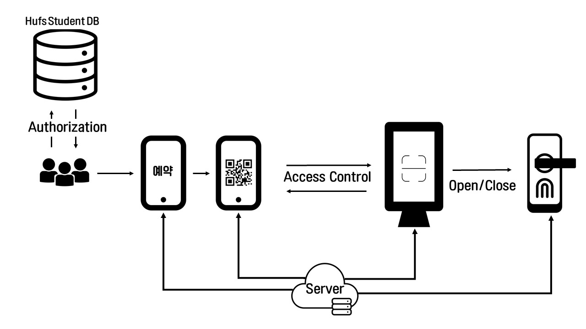

# 🔗 hoops

한국외대 스터디룸 예약 출입통제 서비스

## Prototype

| 리소스          | 링크                                                                          |
| --------------- | ----------------------------------------------------------------------------- |
| 웹 UI 개발 링크 | [Figma](https://www.figma.com/file/OEHffeqAsD5BzfhQLZ1vTP/hoops?node-id=0%3A1) |

## Architecture

## Stack

| Category  | Stack                                                     |
| --------- | --------------------------------------------------------- |
| Front-end | `React` `styled-components` `JavaScript` `Apollo GraphQL` |
| Back-end  | `Node.js` `Express` `PostgreSQL`                          |
| Design    | `Figma`                                                   |
| Embedded  | `Raspberry Pi`                                            |
